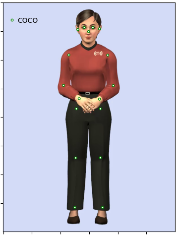

Instructions

|Approach | 2d Detector| 2d keypoints format(input) | 3d Detector  | 3d keypoints format(output) |
| :-------------: | :-------------: |:-------------:| :-----:|:-----:|
| *openpose*  | openpose*  | H3.6m | Videopose3D(pretrained_h36m_cpn.bin) | H3.6m |
| *detectron* | detectron | COCO  | Videopose3D(pretrained_h36m_detectron_coco.bin) | H3.6m |
| *mpcoco* | mediapipe | COCO  | Videopose3D(pretrained_h36m_detectron_coco.bin) | H3.6m |
| *mp3d* | mediapipe | COCO | mediapipe | H3.6m (after adjustment)|

* midhip and spine is artificially created based on adjacent keypoints. 

Run on Google Colab :
https://colab.research.google.com/drive/1s7ASDuQjFfxZzCKvrpeWO1LBhn26Nd-u?usp=share_link

